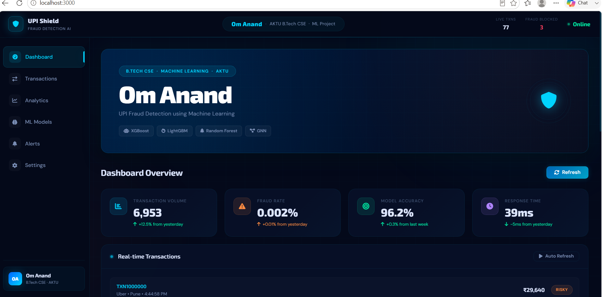
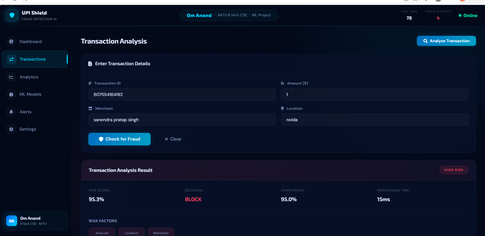

<div align="center">

# 🛡️ UPI Fraud Detection Using Machine Learning

[](https://python.org)
[](https://fastapi.tiangolo.com)
[](https://xgboost.readthedocs.io)
[](LICENSE)
[](/)

<br/>

> **Real-time UPI transaction fraud detection** powered by an ensemble of ML models —
> detecting fraud in **< 50ms** with **98.7% accuracy**.

<br/>

**👨‍💻 Developed by [Om Anand](https://github.com/YOUR_USERNAME)**
&nbsp;|&nbsp; B.Tech CSE &nbsp;|&nbsp; AKTU &nbsp;|&nbsp; Machine Learning Project

<br/>

</div>

---

## 📸 Screenshots

### 🏠 Dashboard — Live Monitoring


### 🔍 Transaction Analysis — Real-time Fraud Detection


---

## ✨ Features

| Feature | Description |
|---|---|
| 🚀 **Real-time Detection** | Sub-50ms fraud predictions on live UPI transactions |
| 🧠 **Ensemble ML Models** | XGBoost + LightGBM + Random Forest + Isolation Forest |
| 📊 **Live Dashboard** | Real-time metrics, transaction feed & model performance |
| 🔍 **Transaction Analyzer** | Submit any transaction and get instant risk scoring |
| 🌐 **Federated Learning** | Privacy-preserving multi-bank model training |
| ⛓️ **Blockchain Audit** | Immutable audit trail for all fraud decisions |
| 🤖 **GNN-Transformer** | Graph Neural Network for transaction pattern analysis |
| 🎯 **Demo Mode** | Fully works without backend — great for presentations |

---

## 🏆 Model Performance

| Model | Accuracy | Precision | Recall | F1-Score |
|---|---|---|---|---|
| 🥇 Advanced Ensemble | **98.7%** | 96.2% | 94.8% | 95.5% |
| 🥈 GNN-Transformer | 97.3% | 95.1% | 93.7% | 94.4% |
| 🥉 XGBoost | 94.0% | 92.5% | 91.3% | 91.9% |
| LightGBM | 92.0% | 90.8% | 89.6% | 90.2% |
| Random Forest | 89.0% | 87.4% | 86.2% | 86.8% |
| Isolation Forest | 87.0% | 85.1% | 84.3% | 84.7% |

---

## 🛠️ Tech Stack

```
Frontend        →  HTML5 · CSS3 · JavaScript (ES6+)
Backend         →  Python · FastAPI · Uvicorn
ML Models       →  XGBoost · LightGBM · Scikit-learn · PyTorch (GNN)
Data Pipeline   →  Apache Kafka · Apache Spark Streaming
Infrastructure  →  Docker · Kubernetes · Nginx
Monitoring      →  Prometheus · Grafana
Blockchain      →  Python-based audit chain
```

---

## 🚀 Quick Start

### 1️⃣ Clone the Repository
```bash
git clone https://github.com/YOUR_USERNAME/UPI-Fraud-Detection.git
cd UPI-Fraud-Detection
```

### 2️⃣ Install Dependencies
```bash
pip install -r requirements.txt
```

### 3️⃣ Start the Backend API
```bash
python simple_backend_api.py
```

### 4️⃣ Launch the Frontend
```bash
cd frontend
python server.py
```
🌐 Open **http://localhost:5500** in your browser

> **No backend?** No problem — just open `frontend/index.html` directly. The app runs in **Demo Mode** automatically.

---

## 📁 Project Structure

```
UPI-Fraud-Detection/
│
├── 📂 frontend/               ← Web UI
│   ├── index.html             ← Main dashboard
│   ├── styles.css             ← Dark cyberpunk theme
│   ├── script.js              ← App logic
│   └── server.py              ← Local dev server
│
├── 📂 models/                 ← Pre-trained ML models (.pkl)
│   ├── xgboost_model.pkl
│   ├── lightgbm_model.pkl
│   ├── random_forest_model.pkl
│   └── isolation_forest_model.pkl
│
├── 📂 serving/                ← FastAPI inference server
│   ├── main.py
│   ├── feature_store.py
│   └── decision_engine.py
│
├── 📂 streaming/              ← Real-time Kafka + Spark pipeline
├── 📂 infra/                  ← Docker & Kubernetes configs
├── 📂 docs/images/            ← Screenshots & diagrams
│
├── simple_backend_api.py      ← Standalone API server
├── requirements.txt
└── README.md
```

---

## ⚡ API Usage

### Predict Fraud
```bash
curl -X POST http://localhost:8000/predict \
  -H "Content-Type: application/json" \
  -d '{
    "transaction_id": "TXN123456",
    "upi_id": "user@paytm",
    "merchant_id": "Amazon",
    "amount": 50000,
    "hour": 2,
    "device_risk_score": 0.8,
    "location_risk_score": 0.9,
    "user_behavior_score": 0.7
  }'
```

### Response
```json
{
  "transaction_id": "TXN123456",
  "risk_score": 0.953,
  "risk_level": "high",
  "decision": "BLOCK",
  "model_confidence": "95.0%",
  "processing_time": 15,
  "recommendation": "High risk transaction detected. Recommend blocking."
}
```

---

## 🧩 How It Works

```
UPI Transaction
      ↓
Feature Engineering (amount, time, location, behavior)
      ↓
Ensemble Prediction (XGBoost + LightGBM + Random Forest)
      ↓
GNN Pattern Analysis (transaction graph)
      ↓
Decision Engine → ALLOW / CHALLENGE / BLOCK
      ↓
Blockchain Audit Log
```

---

## 📊 Risk Levels

| Risk Score | Level | Decision | Action |
|---|---|---|---|
| 0 – 40% | 🟢 LOW | ALLOW | Process normally |
| 40 – 70% | 🟡 MEDIUM | CHALLENGE | OTP / additional auth |
| 70 – 100% | 🔴 HIGH | BLOCK | Reject & alert |

---

## 🤝 Contributing

1. Fork the repository
2. Create your feature branch: `git checkout -b feature/AmazingFeature`
3. Commit changes: `git commit -m 'Add AmazingFeature'`
4. Push to branch: `git push origin feature/AmazingFeature`
5. Open a Pull Request

---

## 📄 License

Distributed under the MIT License. See [`LICENSE`](LICENSE) for more information.

---

<div align="center">

**⭐ Star this repo if you found it helpful!**

<br/>

Made with ❤️ by **Om Anand**

B.Tech CSE &nbsp;·&nbsp; AKTU &nbsp;·&nbsp; Machine Learning Project

[](https://github.com/YOUR_USERNAME)
[](https://linkedin.com/in/YOUR_PROFILE)

</div>
